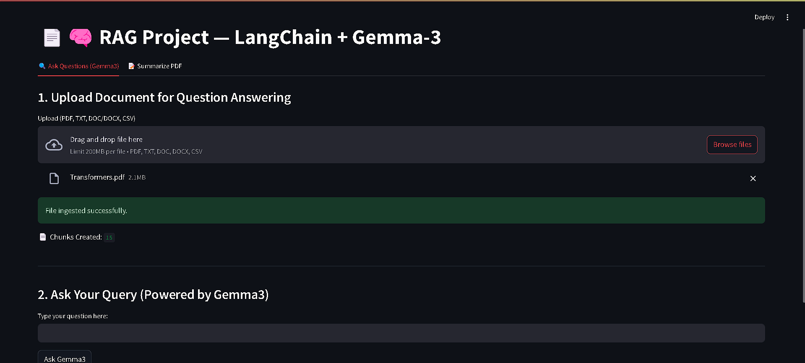

# 🧠 RAG System with Google Gemma-3 + FastAPI + Streamlit

A full-stack **Retrieval-Augmented Generation (RAG)** project powered by **Google's latest Gemma-3 LLM**, this system enables intelligent document-based question answering and summarization using local LLM inference. Built for both learning and showcasing modern AI engineering, this project includes a **FastAPI backend** and **Streamlit frontend**, and integrates Chroma vector store with LangChain for document retrieval.

---

## 📌 Table of Contents
- [🚀 Introduction](#-introduction)
- [🧰 Tech Stack](#-tech-stack)
- [📁 Project Structure](#-project-structure)
- [⚙️ Installation](#-installation)
- [▶️ How to Run](#-how-to-run)
- [💡 Features](#-features)
- [📚 Applications](#-applications)
- [📸 Screenshots](#-screenshots)

---

## 🚀 Introduction

This project is a practical implementation of a **local RAG (Retrieval-Augmented Generation) pipeline** using Google's recently released **Gemma-3 LLM**. It combines:

- 📄 Document ingestion (PDF, TXT, DOCX, CSV)
- 🔍 Vector-based retrieval (using LangChain + ChromaDB)
- 🧠 Contextual answer generation & summarization (using Gemma-3)
- 🌐 Full-stack app with FastAPI + Streamlit

### ✨ Why This Project?
This was created as an **AI engineering experiment** to:
- Test the performance of Google's **Gemma-3 LLM (2025)** locally
- Build a scalable pipeline for enterprise-style document QA
- Offer a hands-on learning example of RAG systems for developers

---

## 🧰 Tech Stack

| Layer         | Tools/Frameworks                                   |
|--------------|----------------------------------------------------|
| **Frontend** | Streamlit                                           |
| **Backend**  | FastAPI, Uvicorn                                    |
| **LLM**      | Google Gemma-3 via HuggingFace Transformers         |
| **Vector DB**| ChromaDB (via LangChain Chroma)                     |
| **Embeddings**| SentenceTransformers (`all-MiniLM-L6-v2`)         |
| **Utilities**| dotenv, docx2txt, pypdf, python-docx                |

---

## 📁 Project Structure
```
RAG-GEMMA3/
├── Backend/
│   ├── main.py                # FastAPI backend
│   ├── main_4bit.py           # FastAPI backend using 4bit quantized Gemma-3
│   └── __init__.py
├── Frontend/
│   └── app.py                 # Streamlit interface for users
├── requirements.txt           # All dependencies
├── run_project.py             # One-click launcher (venv + server start)
├── .gitignore
└── .env                       # API keys or model paths (optional)
```

---

## ⚙️ Installation

### 🔧 Prerequisites
- ✅ Python 3.11 (strictly required)
- ✅ Git installed

### 🛠️ Steps to Setup
```bash
# 1. Clone the repository
git clone https://github.com/Kartik-A-1820/RAG-GEMMA3.git
cd RAG-GEMMA3

# 2. Run the auto setup script (creates venv, installs, launches everything)
python run_project.py
```

> 🚀 This will:
> - Create `venv/`
> - Install all required packages
> - Start backend on `http://localhost:8000`
> - Start frontend on `http://localhost:8501`

---

## ▶️ How to Run (Manual Option)
If you want to run manually:
```bash
# 1. Clone the repository
git clone https://github.com/Kartik-A-1820/RAG-GEMMA3.git
cd RAG-GEMMA3

# 2. Create a virtual environment
python -m venv venv

# 3. Activate the virtual environment
# For Windows:
venv\Scripts\activate
# For Linux/macOS:
source venv/bin/activate

# 4. Install dependencies
pip install -r requirements.txt

# 5. Start the FastAPI backend (in one terminal)
uvicorn Backend.main_4bit:app --host 0.0.0.0 --port 8000 --reload

# 6. Start the Streamlit frontend (in another terminal)
streamlit run Frontend/app.py
```

---

## 💡 Features

- ✅ **Document Ingestion**
  - Upload PDF, TXT, DOCX, CSV
  - Content is split and vectorized

- 🔍 **Semantic Search & QA**
  - Uses Chroma for fast retrieval
  - Top relevant chunks used for context

- 🧠 **Answer Generation**
  - Powered by quantized Gemma-3 LLM
  - Returns grounded answers with source references

- 📝 **PDF Summarization**
  - Summarizes long documents into concise texts
  - Chunked batching with final merged summary

- 🧪 **One-click launcher**
  - `run_project.py` simplifies setup and execution

---

## 📚 Applications

- 📊 **Enterprise Search**: Build intelligent internal knowledge bases
- 📚 **Academic Summarizers**: Convert papers/books into key points
- 📄 **Legal Document QA**: Upload policies/contracts and ask questions
- 🧠 **AI-Powered Assistants**: Build a base for offline personal AI
- 💼 **Resume/Job-Description Matching**: Semantic profile matching

---

## 📸 Screenshots

### 🏠 Home Page


### 📄 Document Ingestion


### ❓ Answering Queries with References


### 📝 Summarizing PDF


---

## 🙌 Credits
- [Google AI](https://ai.google.dev/gemma) for releasing Gemma-3
- [LangChain](https://www.langchain.com)
- [HuggingFace Transformers](https://huggingface.co/transformers)
- [Chroma Vector DB](https://www.trychroma.com)

---

> 💬 Have questions or want to collaborate? Reach out at [LinkedIn](https://www.linkedin.com/in/kartik-anagawadi-4b33a81b6/)

